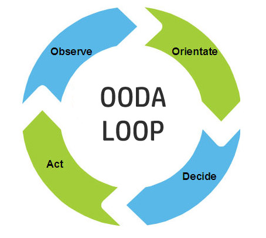
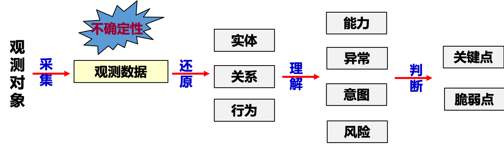
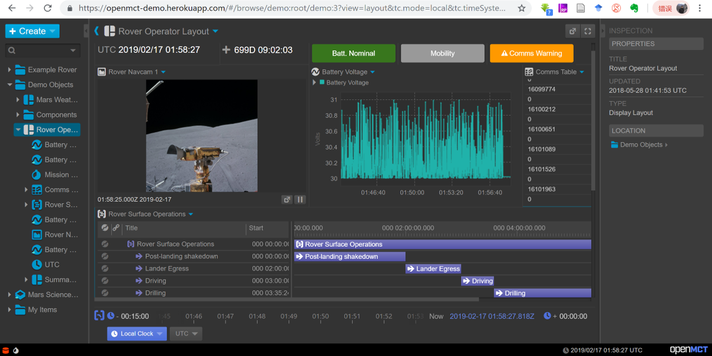

# What is C2
指挥控制（Command and Control, **C2**）是我们今天再熟悉不过的军事术语。其不仅代表了军事中的核心活动，也广泛体现在生产、管理以及日常生活中。

例如，军队中有各级各类的指挥所，企业有用于生产的指挥调度系统，政府有应急指挥中心。日常生活中，教练指挥比赛、交警指挥交通、指挥家指挥演奏等等。可以说，人类的群体性活动都离不开指挥控制。

另一方面，作为实现指挥控制的技术平台，各种指控系统（C2系统）不仅是计算机、网络、人工智能等先进技术应用的产物，也直接推动着技术的发展与革新。例如，第一套基于计算机的C2系统——赛其系统（[SAGE, Semi-Automatic Ground Environment](https://en.wikipedia.org/wiki/Semi-Automatic_Ground_Environment)），为了实现对苏联远程轰炸机的早期预警与拦截，首次将雷达与计算机通过电话线进行连接，导致了计算机广域网的出现，并催生了互联网的前身——APRNET。

>除了计算机网络外，SAGE系统还创新出了磁芯存储器、基于光笔及CRT的人机交互、软件工程等当今耳熟能详的技术，并催生了鼎鼎大名的MIT林肯实验室以及MITRE公司等重量级企业。SAGE系统被认为是计算机发展史上的一座丰碑，位于硅谷的计算机博物馆（紧挨谷歌公司总部）收藏了SAGE系统的部分设备，有机会一定要去膜拜一下。

指挥控制相关的例子、术语及概念演化请参考站内博文“[C2的概念及其演化](./Concept.md)”。简单来讲：

“**指挥**”意为上级对下级行使权利，对行动进行组织领导。指挥是系统的源动力，**基础**是法定或个人的威信，**核心**是决策、判断以及行动（作战）构想，**前提**是信息交互，**形式**既包括艺术，也涉及科学。

“**控制**”意为驾驭、支配、掌握，使不超出范围。从自动控制的角度看，**负反馈** 是实现控制过程的前提；从控制论的角度看，“**可能性空间**”是其最基本的概念。控制归根结底，是一个在事物可能性空间中进行有方向的选择的过程：
 - 了解事物面临的可能性空间是什么
 - 在可能性空间中选择某些状态作为目标
 - 控制条件，使事物向既定目标转化

（——参见金观涛《[控制论与科学方法论](http://product.dangdang.com/9014495.html)》）。

PLA军语将“指挥控制”定义为：“**指挥员及其指挥机关对部队作战或其行动掌握和制约的活动**”，美军及北约也有相应的定义（参见“[C2的概念及其演化](./Concept.md)”）。

C2术语的出现体现了“指挥”、“控制”的结合，一方面体现了战争对战场硬件设施和技术的依赖性越来越强，另一方面也体现了由于战争活动中所涉及要素的复杂性增强，以至于对战场的集中控制成为必须。因此，C2是“战争机器”精确、快速、高效运作的需要，也是科学技术，特别是工业革命以来的科学技术在军事领域运用的产物。

对于两者的关系，我们有如下理解：

 - 从时序看，“指挥”必须为将要完成之事明确方向，并塑造系统的特征和本质，以便认识和塑造将要完成之事；而“控制”必须对正在完成之事进行清楚和毫不含糊的评估，并对过程进行修正。(**指挥控制必须允许人们指导和塑造将要完成之事，同时允许人们根据对正在完成之事的评估修正这种指导。——约翰.R.博伊德**)
 - 从特征看，“指挥”解决的是作战当中诸如谋划、决策等重大问题，是一种创造性很强的活动，因此具有更多的灵活性、策略性、艺术性。“控制”是把决心变为现实、逐步实现作战目标的具体措施和过程，具有创造性，但更富事务性、规范性、程序性和可操作性。

因此，有个形象的比喻：如果将兵力比作马，指挥比作骑手，控制比作挽具。

C2过程最广为人知的是[**OODA**](https://en.wikipedia.org/wiki/OODA_loop)模型，简言之是指从“观察”到“行动”，也是从“数据”到“决策”的过程。

# 研究问题

C2的成效是胜负的决定性因素。在战争中，任何一项其它活动的重要程度都无法与指挥与控制相提并论。因此，C2理论与技术的研究一直是军事、管理、理论研究中最活跃的领域之一。值得指出的是，C2研究具有典型的交叉、跨学科的特点，涉及的相关学科包括计算机、通信、控制、数学、军事、管理、系统工程等。

我们将所关心的C2问题划分为“理论”、“技术”两大类型。“理论”侧重对基本原理的研究，主要包括C2的领域、模式、过程、方法、组织设计等问题，“技术”侧重OODA闭环中各类支撑、使能技术的研究，可大致归结为态势认知、任务规划两类，如下图所示。

## C2理论

20世纪90年代以来，新一轮以信息化为标志的军事变革掀起了以消除各军兵种“烟囱系统”、建立指挥系统之间的“互联、互通、互操作”为目的的C2系统发展高潮。C2迅速从单纯的C2演化到 C3I、C4I、C4ISR等等，技术元素与功能形式等越来越多，结构与过程越来越复杂，涉及到的人、信息与结构及其对象等指挥与控制要素都发生了发生深刻变化。**智能** 技术的迅速兴起又给C2注入了新的发展动力，以智能化为特征的C2系统成为未来发展的重点，整个领域面临着一场深刻的变革。在信息与智能时代，C2可以突破传统的统一指挥、统一意图、等级组织、直接控制等方式，并表现出不确定性、动态性、随机性、涌现性、非线性等特点。

这些变革，都触及到C2的本质——结构与过程、决策与智能等基础理论问题。就像牛顿发现万有引力之前我们看待苹果落到地上，对现象的漠视往往是我们认识科学掌握真理的桎梏。尽管不乏有真知灼见的观点和宏篇巨著探索了C2相关的理论问题，也有从战术到战略C2系统的设计与运用，但关于C2本质的认识仍然缺乏从现代科学（系统论、控制论、信息论等）的角度进行深刻的剖析，诸多C2系统设计与使用仍然没有突破工业时代机械化战争的思维模式的限制。

因此，重新认识和理解C2成为一项十分迫切的重要任务。对C2本质的认识，需要从源头探究其基础理论的发展，以新的技术、新的使命与任务为出发点,建立新的C2基础理论。

我们认为，C2的基础理论问题主要包括以下几个方面：
 - [如何从复杂性角度构建指挥与控制的基础理论？](./research/C2_Infra.md)
 - [如何建立指挥与控制在物理、信息、认知、作战等多域的交互模型？](./research/C2_MD.md)
 - [面向敏捷性的指挥与控制方式应该如何设计？](./research/C2_Agile.md)
 - [指挥与控制要素如何组织与优化？](./research/C2_Org.md)
 - 指挥与控制的运行过程是什么？
 - 指挥与控制的有效性如何测量和评价？

>有关以上问题的整体性简要描述请参考“[信息与智能时代指挥与控制基本理论问题](https://mp.weixin.qq.com/s/sfib0Opef_FxsoY-j8Cbyw)”）。

## C2技术

C2技术，可以理解为贯穿从“观察”到“行动”的循环中的支撑和使能技术，可以形象地理解为“知而后行”。“知”对应态势认知技术，“行”对应任务规划技术。“知行合一”，才能无往而不胜。

### 态势认知

**态势** 是指状态与形势，包括人或事表现出的形态、环境或事物的发展状况和情形等，各种事实、信息和认知等纷乱复杂的状态和现象就构成了态势。

两千多年前，《孙子兵法》的形篇、势篇和虚实篇中就详细阐述了战场环境、部署、军事实力及运用对作战的影响，在谋攻篇中提出的“知己知彼，百战不殆”，进一步突显出了掌握战场态势的重要性。PLA军语将态势定义为: 敌对双方部署和行为所形成的状态和形势。我们认为战场态势是作战空间内战场环境以及敌我双方兵力和装备部署的当前状态和形势，及其**变化发展趋势**。

针对战场态势，其组成包括以下几方面：
 - 敌我态势，或称为作战态势，是作战各方部署和行动所形成的状态和形势，及其变化发展趋势。
 - 战场环境的状态和形势，及其变化发展趋势。
 - 各类约束条件、时间与空间关系、机会与风险因素等。

 对态势的认知是行动的前提。（战场）**态势认知** 是指在一定的时间和空间范围内，指挥决策人员对战场态势的智能处理，包括对战场态势元素的含义理解，以及对它们未来的改变进行预测，是指挥决策人员对态势的内在理解的一个过程。态势认知是人类心智模型的一种体现。心智模型是指人通过眼睛、耳朵等传感器，接受外界数据与信息以后会在脑中形成一个思维的模型来描述外部世界，并对它的运行发展进行分析、判断和预测。因此，态势认知过程从信息融合的基础上开始，通过对态势要素（敌我态势、战场环境等）进行识别、描述、解释、评价等一系列处理过程，由表及里、由此及彼地梳理、判断、预测态势，形成对态势的理解和认知。

 以空情态势为例：针对来袭的飞行器，首先通过各类传感器获取关于目标的各维度观测数据，通过数据融合、关联，形成目标航迹，并基于特征识别目标类型，最终形成对目标威胁程度的判断。
 

 由此可见，在态势认知过程中，既涉及基于数据的客观还原，也有对形势和趋势的主观理解和判断。这一过程可分为四个层次：数据（Data）、信息（Information）、知识（Knowledge）和理解（Understanding）。其中：
  - **数据**：通过观测，获取关于态势要素的表征
  - **信息**：通过对数据的解读、关联、融合，还原数据的含义
  - **知识**：通过对信息进行过滤、提炼，挖掘高阶、深层的规律
  - **理解**：形成对态势的主观认识、预测未来，并演绎出解决方案

JDL、SA是与态势认知密切相关的两个过程模型，前者基于数据处理与融合的角度，后者则基于决策者的认知角度。JDL模型可参见“[Revisions to the JDL
Data Fusion Model](http://dsp-book.narod.ru/HMDF/2379ch02.pdf)”，SA模型可参见维基百科词条"[Situation Awareness](https://en.wikipedia.org/wiki/Situation_awareness)"，以及“[什么是态势感知？](https://mp.weixin.qq.com/s/0J-TjPgBWmZWjnzqi9nXHA)”

大数据与AI技术的突飞猛进为态势认知提供了新的方法与思路，大量无人作战装备走向战场也使得自动化、智能化的态势认知成为发展趋势。但是，与其他问题领域相比（如当今AI技术大显身手的棋牌类游戏），面向战场的态势认知主要难点在于：
 - 强对抗、观测不完全
 - 规模大、要素复杂
 - 实时性、完整性、准确性要求高
 - 游戏规则可能变化或颠覆

 在这种开放、极端环境下，如何形成准确的态势认知，一直是态势认知研究中的重难点问题。在大数据和智能化的时代背景下，这一问题显得尤为重要和有价值。

我们所关心的态势认知研究问题主要包括：
 - [如何发现、识别对象，并还原对象间的结构和关系？](./research/SA_Uncover.md)
 - [如何检测异常、评估威胁、理解意图、预测发展？](./research/SA_Understand.md)
 - [如何判断关键点、脆弱点？](./research/SA_Identify.md)

### 任务规划

**任务规划** 指根据意图生成具体可实施的行动计划，其本质是把有限的资源在正确的时间部署到正确的地点去执行正确的任务，并在这一过程中实现预设目标的优化。它是一个涉及到行动过程、资源调度、时空协同等要素的决策过程。在日常生活中，个人及团队的任务管理、活动安排、路线规划，以及企业生产中的资源调度、人员排班等，也都是任务规划的具体体现。

古今中外的军事理论无不强调筹划、计划的重要性。《孙子兵法》将“计”作为开篇，进行了专门的论述，认为“夫未战而庙算胜者，得算多也，未战而庙算不胜者，得算少也。多算胜，少算不胜，而况无算乎”。宋代《册府元龟》卷“任篇”说，“运筹于帷握之中”。克劳塞维茨在《战争论》中提出：“战争计划总括全部军事行动，并且使它成为具有一个最终目的的统一行动”。

从决策的层次看，规划问题一般可分为三个层次：战术(Tactical)、战役（Operational）、战略（Strategical）。随着层次的提高，人的“谋略”成分增加，对技术和平台的依赖越低。任务规划的技术研究主要针对前两个层次。

在**战术层**，典型的任务规划问题如卫星观测任务规划、巡航导弹的路线规划、无人设备的载荷及行动规划等等。下图是NASA开源的数据可视化与任务规划框架软件[OpenMCT](https://nasa.github.io/openmct/)的界面，可对火星车任务进行管理调度以及状态监控。

在**战役层**，一般需要将问题划分为多个阶段，考虑多类资源、装备、人员，处理复杂的协同关系和约束，生成、分析、优选行动序列。

例如，下图是美空军的联合任务规划系统[JMPS-AF](http://www.dote.osd.mil/pub/reports/fy2012/pdf/af/2012mps-jmps-af.pdf)的界面。

由于问题的复杂性，**战役层** 的决策过程可以拆分为两个相对独立而又紧密联系的过程。一是“**筹划**”过程，指在态势认知基础上对行动的目的、风险、过程、约束等要素进行整体构想，生成、分析、优选行动序列（Course of Action, COA）；另一个是“**计划**”过程，指通过一定的技术手段，将筹划结果转化为可实施的作战方案和行动计划。为确保决策质量和效率，通常还有规范的决策流程作为依据。

例如，美军联合出版物JP5-0 "Joint Planning"(2017)将联合任务规划的流程分为：任务分析、COA生成、COA分析与推演、COA比较、COA批准、计划与指令生成等阶段。 “筹划”一般由指挥员在参谋团队的支撑下完成；“计划”则由参谋人员和专业技术人员依据筹划结果（COA）完成。

下图则描述了DARPA "[X计划](https://www.csmonitor.com/World/Passcode/2015/0216/The-Pentagon-is-building-an-app-store-for-cyberoperations)"中关于Cyber行动计划生成过程的示意图。

有关任务规划的概念、流程等，可参考“[浅谈对作战任务规划的认识](https://mp.weixin.qq.com/s/F8X2oXXqvxYKw7uiBeYO2A)”、“[从作战筹划到联合任务规划](https://mp.weixin.qq.com/s/zQF4bDCxgJSDP4mNL2wlsQ)”等文献。

如何在激烈变化、瞬息万变的对抗环境下，快速、高效地进行规划，并及时按需调整和优化，是任务规划中的重难点问题。我们所关心的任务规划研究问题主要包括：
 - [如何构建通用及面向领域的任务清单，以支持自动化的任务组合与编排？](./research/TP_TaskList.md)
 - [如何结合意图识别，进行对抗条件下的在线任务规划？](./research/TP_Online.md)
 - [如何针对具有并发、偏序等特点的复杂任务流程进行高效、鲁棒的资源调度？](./research/TP_Complex.md)
 - [如何对计划中的时间、空间、资源等要素进行冲突检测与消解？](./research/TP_Conflict.md)
 - [如何基于智能化技术提高时敏任务规划的时效和质量？](./research/TP_AI.md)
 - [如何对COA进行实验，以全面分析评价其效能与风险？](./research/TP_Exp.md)

# 关于我们
  **C2 Group** in Science and Technology on Information Systems Engineering Laboratory, National Unversity of Defense Technology.

 - [Projects](./Projects.md)  
 -- [态势感知](./SA-project-1.md) 
 - [Publication](./Publication.md)
 - [Talks and Presentations](./Talks.md)
 - [Dataset and Codes](./Dataset.md)
 - [News and Events](./News.md)
 - [Resources](./Resources.md)
 - [Getting Started (For Students)](./Students.md)
