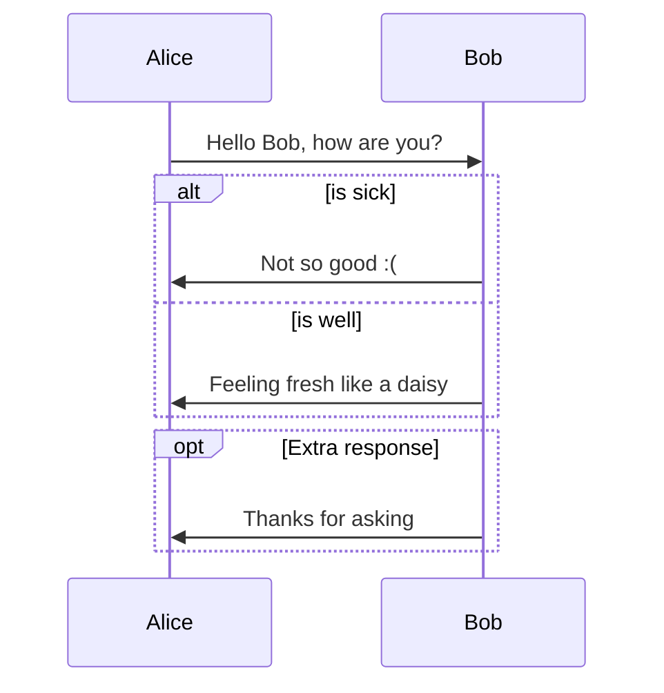

# What is C2
指挥控制（Command and Control, **C2**）是我们今天再熟悉不过的军事术语。其不仅代表了军事中的核心活动，也广泛体现在生产、管理的各个环节。其中：
“**指挥**”是系统的源动力，**基础**是法定或个人的威信，**核心**是决策、判断以及行动（作战）构想，**前提**是信息交互，**形式**既包括艺术，也涉及科学。

“**控制**”意为驾驭、支配、掌握，使不超出范围。从自动控制的角度看，负反馈是控制的核心概念；从控制论的角度看，可能性是其最基本的概念。控制论作为一门科学的诞生，直接导致了C2理论与技术的萌芽和发展。

“指挥控制”的定义：**指挥员及其指挥机关对部队作战或其行动掌握和制约的活动（PLA新版的军语）**。

>指挥控制必须允许人们指导和塑造将要完成之事，同时允许人们根据对正在完成之事的评估修正这种指导。——约翰.R.博伊德

C2是机械化战争指挥系统精确、快速、高效运作的需要，也是工业时代科学技术进步在军事领域运用的产物。指挥必须为将要完成之事确定明确的方向，必须与系统相互影响并塑造系统的特征和本质，以便认识将要完成之事。而控制必须对正在完成之事进行清楚和毫不含糊的评估，必须确定（不是塑造）正在完成之事的特征/性质。

“指挥”与“控制”的关系，可以理解为：指挥解决的是作战当中诸如谋划、决策等重大问题，是一种创造性很强的活动，因此具有更多的灵活性、策略性、艺术性。控制是把决心变为现实、逐步实现作战目标的具体措施和过程，具有创造性，但更富事务性、规范性、程序性和可操作性。如果将兵力比作马，指挥比作骑手，控制比作挽具。

C2术语及概念经过了漫长的演化过程，逐步发展出C3/C3I/C4/C4I/C4ISR等一系列术语。

有关C2相关概念及其演化，请参考站内博文“[C2的概念及其演化](./C2_Concept.md)”。

# 研究问题 
C2的研究问题分为两个层次，三类问题。
## C2理论
对于它在军事领域的存在没有人质疑其重要性和不可或缺性，在军事行动上实施指挥控制任何理性的人都会认为是理所当然，就像牛顿发现万有引力之前我们看待苹果落到地上。然而，对现象的漠视往往是我们认识科学掌握真理的桎梏。自C2见诸于军事领域以来，不乏有真知灼见观点和宏篇巨著的研究文献探索C2的相关问题，也有从战术到战略C2系统的设计与运用，但关于C2本质的认识仍然缺乏从现代科学（系统论、控制论、信息论等）的角度进行深刻的剖析。诸多C2系统设计与使用仍然没有突破工业时代机械化战争的思维模式的限制。

## C2技术

# 如何开始

# 关于我们
  C2 Group in Science and Technology on Information Systems Engineering Laboratory, National Unversity of Defense Technology. 
