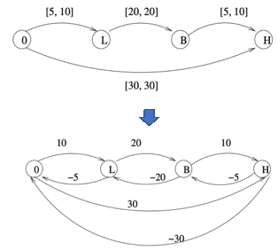

# 决策评估——计划

## 问题概述

计划中的主要问题是在COA的基础上，对任务、资源、时序、行动等进行细化设计，包括
- 如何针对行动序列匹配资源、确定时序？
- 如何确定行动路线？
- 如何消解冲突？时间、空间、资源、频谱等
- 如何根据情况变化快速应对调整？

### 资源调度

资源包括人员、带宽、软件、计算、存储、跳板、漏洞等，需要优化流程、资源分配、任务时序等。
例如，在F1比赛中的进站加油换胎是一个高度优化的资源调度的实例，全过程最快仅需1.92秒。

航母上的航空保障也是一个需要高度优化的资源调度实例，包括流程、人员编组、保障装备等要素，直接决定了航母的核心战斗力：单位时间出动舰载机的架次率。

在网络空间中，随着5G等新一代网络的应用的推广与普及，网络虚拟化、软件定义网络等技术逐渐成为新一代网络的使能技术，网络架构正在发生深刻变化，网络即服务、安全即服务等理念将逐步成为现实。与之对应的，通过软件定义、虚拟化等手段调度、管理网络及其安防资源将成为必然，而如何对这一过程中涉及到的各类资源进行优化调度已成为了一个重要的前瞻性问题。

### 路径规划

网络空间行动中的路径规划，可基于关键地形（如入口点、必经点、障碍点、规避点等）的识别结果，并考虑可达性、风险、稳定性等要素。如何进行跨层的路径规划建模与求解，是网络空间中具有特色的问题。

### 冲突检测与消解

在多人协同的筹划中，可能存在时间、空间、资源等冲突，因此需要研究各类冲突的高效检测与消解方法。如，简单时序网络（STN）就是一种将任务之间的时序关系表达成图，并通过负环检测来发现时序冲突的方法。

### 动态重规划

在计划执行过程中，遇到变化或之前未预料到的突发情况时，需要对计划进行动态调整，以适应新情况。增强对抗环境下计划的鲁棒性、适应性，是具有理论价值与现实意义的重要问题。

## 研究选题

- [如何结合意图识别，进行对抗条件下的在线任务规划？](./TP_Planning_Online.md)
- [如何针对具有并发、偏序等特点的复杂任务流程进行高效、鲁棒的资源调度？](./TP_Planning_Complex.md)
- [如何对计划中的时间、空间、资源等要素进行冲突检测与消解？](./TP_Planning_Conflict.md)
- [如何基于智能化技术提高时敏任务规划的时效和质量？](./TP_Planning_AI.md)
